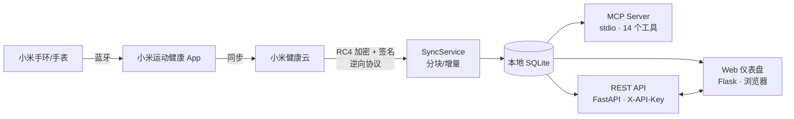

# Mi Fitness MCP CN

[](https://github.com/HUAYUE1024/mi-fitness-mcp-cn/actions/workflows/ci.yml)
[](https://www.python.org/downloads/)
[](LICENSE)
[](CHANGELOG.md)

小米运动健康（Mi Fitness）数据的**本地一站式解决方案**：MCP Server + REST API + 可视化 Web 仪表盘。把你自己账号里的健康数据同步到本地 SQLite，供 AI 客户端、其他程序或浏览器直接查询分析。

> Local-first Mi Fitness (Xiaomi health) data hub: sync your own health data to a local SQLite database, exposed via MCP, REST API, and a web dashboard.

基于 [kubulashvili/mi-fitness-mcp](https://github.com/kubulashvili/mi-fitness-mcp) 修改并深度重构。

## 功能特性

- 🇨🇳 **中国区云端适配**（`--region cn`），同时支持 ru/de/sg/us 等国际区
- 📦 **三种接入方式**：MCP Server（AI 客户端）、REST API（任意程序）、Web 仪表盘（浏览器）
- 💤 **全量健康指标**：每日活动、逐分钟心率、睡眠分期（深睡/浅睡/REM/小睡）、运动记录、身体成分、血氧（SpO₂）、压力、异常心跳
- 🔄 **增量同步引擎**：7 天分块拉取 + 断点续传游标 + UPSERT 幂等入库，重复同步不产生脏数据
- 🔑 **API Key 体系**：用小米凭据换取 `mif_sk_*` Key（类大模型平台风格），支持多账号隔离、用量统计、按前缀吊销
- 📱 **扫码登录**：逆向小米官方扫码流程，手机 App 扫码即可授权，告别浏览器 F12 抓 Cookie
- 🖥️ **现代化 Web 仪表盘**（Flask）：数据图表走势、实时响应检视、cURL 一键生成、深浅主题
- 🔒 **本地优先**：数据、凭据、配置全部留在本机（SQLite + 系统 keyring），不上传任何第三方服务

> ⚠️ 非小米官方项目。全部云端接口为逆向所得，仅用于读取和分析**你自己的**健康数据，请遵守小米用户协议。接口可能因小米改版而失效。

## 架构



## 支持的数据

| 类型 | 内容 | CLI `--type` | API 端点 |
|---|---|---|---|
| 每日活动 | 步数、距离、活动卡路里 | `daily_activity` | `/api/summary` |
| 心率 | 逐分钟采样 + 静息心率 | `heart_rate` | `/api/heart-rate` |
| 睡眠 | 时长、入睡/清醒、分段（深睡/浅睡/REM） | `sleep` | `/api/sleep` |
| 运动 | 类型、时长、距离、卡路里、心率、配速 | `workouts` | `/api/workouts` |
| 身体成分 | 体重、BMI、体脂、肌肉量等（需体脂秤） | `body_measurements` | `/api/body-measurements` |
| 血氧 | SpO₂ 采样 | `spo2` | `/api/spo2` |
| 压力 | 压力分数 + 等级 | `stress` | `/api/stress` |
| 异常心跳 | 事件起止与时长 | `abnormal_heart_beat` | `/api/abnormal-heart-beat` |

## 快速开始

### 安装

```bash
git clone https://github.com/HUAYUE1024/mi-fitness-mcp-cn.git
cd mi-fitness-mcp-cn
python -m venv .venv
source .venv/bin/activate      # Windows: .venv\Scripts\activate
pip install -e '.[all,dev]'    # 含 FastAPI 与 Flask Web UI；仅核心功能: pip install -e .
```

要求 Python ≥ 3.11。Linux 无系统 keyring 时可 `pip install keyrings.alt`（可能明文存储凭据）。

### 获取凭据（二选一）

**方式 A：Web 仪表盘扫码登录（推荐，无需浏览器 F12）**

```bash
mi-fitness-mcp api    # 终端 1：后端 API 服务 (127.0.0.1:8321)
mi-fitness-mcp web    # 终端 2：Web 仪表盘 (127.0.0.1:8322)
```

浏览器打开 `http://127.0.0.1:8322/` → 点击「扫码登录」→ 用小米账号 / 米家 App 扫码确认 → 自动换取并注入 API Key。

**方式 B：手动配置凭据**

浏览器登录 [account.xiaomi.com](https://account.xiaomi.com)，从 Cookie 获取 `userId` 与 `passToken`：

```bash
mi-fitness-mcp setup --mode mi_fitness_cloud --user-id "<userId>" --pass-token "<passToken>" --region cn
mi-fitness-mcp doctor        # 验证连通性
```

### 同步与使用

```bash
mi-fitness-mcp sync --start-date 2026-01-01 --end-date 2026-06-30              # 全量同步
mi-fitness-mcp sync --type sleep --start-date 2026-06-01 --end-date 2026-06-30 # 按类型
mi-fitness-mcp sync                                                            # 无日期：从上次断点续传（首次为最近 30 天）
```

**接入 MCP 客户端**（Claude Desktop 等）：

```json
{
  "mcpServers": {
    "mi-fitness": { "command": "mi-fitness-mcp", "args": ["serve"] }
  }
}
```

MCP 工具（14 个）：`get_connection_status` · `sync_data` · `get_sync_status` · `get_profile` · `get_daily_summary` · `query_metric_series` · `query_heart_rate` · `query_body_measurements` · `query_sleep` · `query_workouts` · `query_spo2` · `query_stress` · `query_abnormal_heart_beat` · `get_data_coverage`

## REST API 与鉴权

```bash
mi-fitness-mcp api [--host 127.0.0.1] [--port 8321]
```

- 交互式 Swagger 文档：`http://127.0.0.1:8321/docs`
- 鉴权层级：

| 层级 | 说明 |
|---|---|
| 默认凭据 | 不带 Key = 使用本机 `setup` 配置的凭据（仅建议 127.0.0.1） |
| 静态 Key | 设置 `MI_FITNESS_API_KEY` 后所有请求须带 `X-API-Key` 头 |
| 发放 Key | `POST /api/auth/keys`（管理端点）用凭据换 `mif_sk_*`，每个 Key 绑定独立账号上下文 |
| 管理鉴权 | Key 发放/吊销与扫码登录端点须带 `X-Admin-Key`（`MI_FITNESS_ADMIN_KEY`，未设则仅限本机） |

```bash
# 发放 Key（真实登录验证凭据）
curl -X POST http://127.0.0.1:8321/api/auth/keys -H "Content-Type: application/json" \
  -d '{"user_id":"...","pass_token":"...","region":"cn","label":"my-app"}'

# 带 Key 查询
curl "http://127.0.0.1:8321/api/summary?start_date=2026-08-01&end_date=2026-08-31" \
  -H "X-API-Key: mif_sk_..."

# 触发同步（前台等待）/ 后台执行
curl -X POST http://127.0.0.1:8321/api/sync -H "Content-Type: application/json" \
  -d '{"start_date":"2026-08-30","end_date":"2026-08-31"}'
```

## 常见问题

<details>
<summary><b>心率/血氧/压力同步不到最新数据？</b></summary>

数据链路是「手环 → 手机 App → 小米云 → 本项目」。步数通常实时性最好；心率/血氧/压力的连续监测需在小米运动健康 App 中开启（如「全天心率监测」「全天压力监测」），且手环需保持佩戴。云端没有的数据本项目无法凭空生成。
</details>

<details>
<summary><b>passToken 过期 / 同步报 401？</b></summary>

passToken 是长期凭据，但退出登录、修改密码或在小米账号安全中心踢出设备都会使其失效。重新到 account.xiaomi.com 获取新的 userId/passToken 运行 `setup`，或直接用扫码登录重新授权。
</details>

<details>
<summary><b>启动报错 `'Server' object has no attribute 'list_tools'`？</b></summary>

MCP SDK 2.x 移除了该 API。本项目已固定 `mcp>=1.0.0,<2`，若你从旧版本升级，重新 `pip install -e .` 让依赖约束生效即可。
</details>

<details>
<summary><b>同步耗时多久？会重复入库吗？</b></summary>

首次全量同步按 7 天分块串行拉取，8 个月数据约数分钟（心率逐分钟采样占大头）；之后增量同步只拉最近数据，数秒完成。所有写入为 UPSERT 幂等，重复同步安全。
</details>

## 项目结构

```text
src/mi_fitness_mcp/
├── main.py               # CLI 统一入口: serve / setup / doctor / sync / api / web
├── server.py             # MCP Server（14 个工具 + 异步同步引擎）
├── api.py                # REST API 服务（FastAPI: 数据端点 + Key 体系 + 扫码登录）
├── web.py                # 可视化仪表盘反向代理服务（Flask）
├── web_assets/           # 前端界面（HTML / CSS / JS）
├── adapters/             # 小米云协议：登录、RC4 加解密、签名、分页、解析
├── services/             # 同步引擎（分块/增量）与查询聚合
├── storage/              # SQLite 数据库引擎（8 张数据表 + sync_state）
├── models/               # Pydantic 数据模型
├── config.py             # 系统配置管理（platformdirs + JSON）
└── auth/                 # keyring 安全凭据存储
testpage/                 # 可选：独立运行的 Web 测试控制台（免安装，直接 python app.py）
docs/                     # 技术文档（见下方）
tests/                    # 单元测试与端到端测试套件
```

数据库与配置位于系统用户目录（`~/.local/share/mi-fitness-mcp/`，Windows 为 `%LOCALAPPDATA%\mi-fitness-mcp\`），凭据存于系统 keyring，均不在仓库内。

## 文档

- [隐私与数据安全审计](docs/PRIVACY.md) —— 数据流向、全部对外请求清单、威胁模型与自验方法
- [完整技术文档](docs/PROJECT_DOCUMENTATION.md) —— 架构、小米云协议逆向细节、存储模型、19 条已知问题清单与重构指南
- [扫码登录实现方案](docs/QR_LOGIN.md) —— 协议时序、端点参数、踩坑记录（`sid=xiaomiio`）
- [贡献指南](CONTRIBUTING.md) · [安全政策](SECURITY.md) · [更新日志](CHANGELOG.md)

## 本地开发

```bash
pip install -e '.[all,dev]'
ruff check src tests    # 代码规范检查（CI 同款）
pytest -v               # 完整测试套件（22 个）
python -m build         # 构建发行包
```

## 安全与隐私

**数据只进不出**：本项目从小米云拉取你自己的数据到本地 SQLite，除小米官方服务器外不与任何第三方通信；无遥测/统计/崩溃上报；所有查询端点断网可用。完整审计见 [docs/PRIVACY.md](docs/PRIVACY.md)。

- `passToken` 等同小米账号登录态，**切勿提交或泄露**；若泄露，请在小米账号安全中心退出设备并重新登录
- 凭据与 API Key 密钥存于系统 keyring（Windows DPAPI / macOS Keychain / Linux Secret Service），不落明文
- 不要提交本地配置、数据库、keyring 文件（`.gitignore` 已默认排除）
- 服务默认仅绑定 `127.0.0.1`，并已启用 CORS 本机限制与 Host 白名单（防恶意网页跨站读取 / DNS 重绑定）。向局域网/公网开放前，务必设置 `MI_FITNESS_API_KEY` 与 `MI_FITNESS_ADMIN_KEY`——健康数据是敏感信息
- 扫码登录端点允许扫码者将其账号登录到你的服务器，务必保持管理鉴权开启

## 免责声明

本项目与小米公司无关。接口为社区逆向成果，不保证持续可用。请仅用于读取和分析您自己的个人健康数据。

## License

[MIT](LICENSE) · 源自上游项目 [kubulashvili/mi-fitness-mcp](https://github.com/kubulashvili/mi-fitness-mcp)
